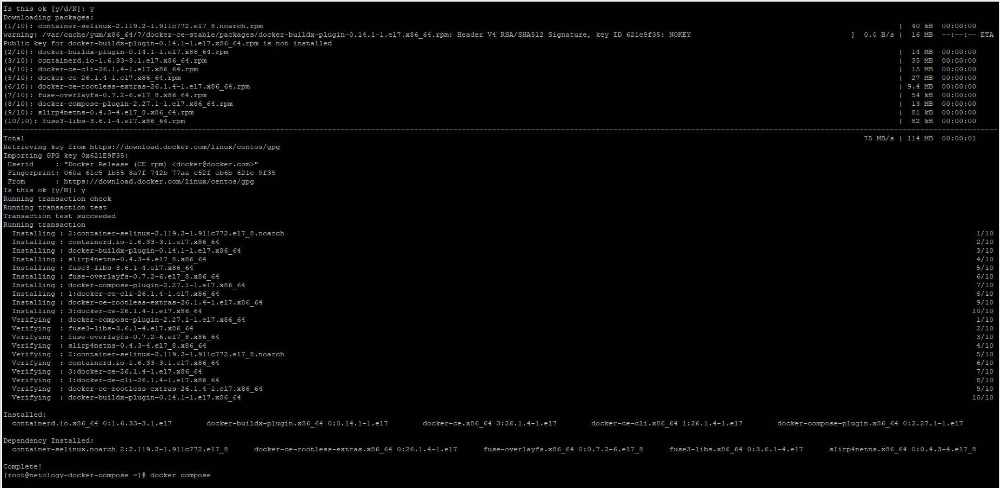
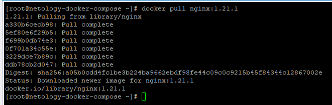

# Домашнее задание к занятию "`Оркестрация группой Docker контейнеров на примере Docker Compose`" - `Дедюрин Денис`

---
## Задание 1

Сценарий выполнения задачи:

- Установите docker и docker compose plugin на свою linux рабочую станцию или ВМ.
- Если dockerhub недоступен создайте файл /etc/docker/daemon.json с содержимым: {"registry-mirrors": ["https://mirror.gcr.io", "https://daocloud.io", "https://c.163.com/", "https://registry.docker-cn.com"]}
- Зарегистрируйтесь и создайте публичный репозиторий с именем "custom-nginx" на https://hub.docker.com (ТОЛЬКО ЕСЛИ У ВАС ЕСТЬ ДОСТУП);
- Скачайте образ nginx:1.21.1;
- Создайте Dockerfile и реализуйте в нем замену дефолтной индекс-страницы(/usr/share/nginx/html/index.html), на файл index.html с содержимым:

```
<html>
<head>
Hey, Netology
</head>
<body>
<h1>I will be DevOps Engineer!</h1>
</body>
</html>
```
- Соберите и отправьте созданный образ в свой dockerhub-репозитории c tag 1.0.0 (ТОЛЬКО ЕСЛИ ЕСТЬ ДОСТУП).
- Предоставьте ответ в виде ссылки на https://hub.docker.com/<username_repo>/custom-nginx/general.

### Ответ:

Установим docker и docker compose plugin командой:
```
sudo yum-config-manager --add-repo https://download.docker.com/linux/centos/docker-ce.repo
```
```
sudo yum install docker-ce docker-ce-cli containerd.io docker-buildx-plugin docker-compose-plugin
```


Стартуем docker командой:
```
systemctl enable --now docker
```
Скачиваем образ nginx:1.21.1 командой:
```
docker pull nginx:1.21.1
```

