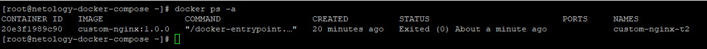

# Домашнее задание к занятию "`Оркестрация группой Docker контейнеров на примере Docker Compose`" - `Дедюрин Денис`

---
## Задание 1

Сценарий выполнения задачи:

- Установите docker и docker compose plugin на свою linux рабочую станцию или ВМ.
- Если dockerhub недоступен создайте файл /etc/docker/daemon.json с содержимым: {"registry-mirrors": ["https://mirror.gcr.io", "https://daocloud.io", "https://c.163.com/", "https://registry.docker-cn.com"]}
- Зарегистрируйтесь и создайте публичный репозиторий с именем "custom-nginx" на https://hub.docker.com (ТОЛЬКО ЕСЛИ У ВАС ЕСТЬ ДОСТУП);
- Скачайте образ nginx:1.21.1;
- Создайте Dockerfile и реализуйте в нем замену дефолтной индекс-страницы(/usr/share/nginx/html/index.html), на файл index.html с содержимым:

```
<html>
<head>
Hey, Netology
</head>
<body>
<h1>I will be DevOps Engineer!</h1>
</body>
</html>
```
- Соберите и отправьте созданный образ в свой dockerhub-репозитории c tag 1.0.0 (ТОЛЬКО ЕСЛИ ЕСТЬ ДОСТУП).
- Предоставьте ответ в виде ссылки на https://hub.docker.com/<username_repo>/custom-nginx/general.

### Ответ:

Установим docker и docker compose plugin командой:
```
sudo yum-config-manager --add-repo https://download.docker.com/linux/centos/docker-ce.repo
```
```
sudo yum install docker-ce docker-ce-cli containerd.io docker-buildx-plugin docker-compose-plugin
```


Стартуем docker командой:
```
systemctl enable --now docker
```
Скачиваем образ nginx:1.21.1 командой:
```
docker pull nginx:1.21.1
```


Создадим файл Dockerfile с содержимым:
```
FROM nginx:1.21.1
COPY index.html /usr/share/nginx/html/index.html
```

Создадим файл index.html с вашим содержимым:
```
<html>
<head>
Hey, Netology
</head>
<body>
<h1>I will be DevOps Engineer!</h1>
</body>
</html>
```

Соберем образ, для этого в директории, где находятся Dockerfile и index.html, выполним команду:
```
docker build -t custom-nginx:1.0.0 .
```


Авторизуемся в Docker Hub, чтобы загрузить образ в созданный репозиторий командой:
```
docker login
```


Тегируем образ и отправляем в репозиторий:
```
docker tag custom-nginx:1.0.0 omegavlg/custom-nginx:1.0.0
```
```
docker push omegavlg/custom-nginx:1.0.0
```


Ссылка на образ в Docker Hub:

https://hub.docker.com/repository/docker/omegavlg/custom-nginx/general

---
## Задание 2

1. Запустите ваш образ custom-nginx:1.0.0 командой docker run в соответвии с требованиями:
- имя контейнера "ФИО-custom-nginx-t2"
- контейнер работает в фоне
- контейнер опубликован на порту хост системы 127.0.0.1:8080

2. Не удаляя, переименуйте контейнер в "custom-nginx-t2"

3. Выполните команду date +"%d-%m-%Y %T.%N %Z" ; sleep 0.150 ; docker ps ; ss -tlpn | grep 127.0.0.1:8080  ; docker logs custom-nginx-t2 -n1 ; docker exec -it custom-nginx-t2 base64 /usr/share/nginx/html/index.html

4. Убедитесь с помощью curl или веб браузера, что индекс-страница доступна.

В качестве ответа приложите скриншоты консоли, где видно все введенные команды и их вывод.

### Ответ:

Выполняем команды задания:
```
docker run -d --name dedyurindn-custom-nginx-t2 -p 127.0.0.1:8080:80 custom-nginx:1.0.0
```
```
docker rename dedyurindn-custom-nginx-t2 custom-nginx-t2
```
```
date +"%d-%m-%Y %T.%N %Z" ; sleep 0.150 ; docker ps ; ss -tlpn | grep 127.0.0.1:8080  ; docker logs custom-nginx-t2 -n1 ; docker exec -it custom-nginx-t2 base64 /usr/share/nginx/html/index.html
```
```
curl http://127.0.0.1:8080
```


---
## Задание 3

1. Воспользуйтесь docker help или google, чтобы узнать как подключиться к стандартному потоку ввода/вывода/ошибок контейнера "custom-nginx-t2".
2. Подключитесь к контейнеру и нажмите комбинацию Ctrl-C.
3. Выполните docker ps -a и объясните своими словами почему контейнер остановился.
4. Перезапустите контейнер
5. Зайдите в интерактивный терминал контейнера "custom-nginx-t2" с оболочкой bash.
6. Установите любимый текстовый редактор(vim, nano итд) с помощью apt-get.
7. Отредактируйте файл "/etc/nginx/conf.d/default.conf", заменив порт "listen 80" на "listen 81".
8. Запомните(!) и выполните команду nginx -s reload, а затем внутри контейнера curl http://127.0.0.1:80 ; curl http://127.0.0.1:81.
9. Выйдите из контейнера, набрав в консоли exit или Ctrl-D.
10. Проверьте вывод команд: ss -tlpn | grep 127.0.0.1:8080 , docker port custom-nginx-t2, curl http://127.0.0.1:8080. Кратко объясните суть возникшей проблемы.
11. Это дополнительное, необязательное задание. Попробуйте самостоятельно исправить конфигурацию контейнера, используя доступные источники в интернете. Не изменяйте конфигурацию nginx и не удаляйте контейнер. Останавливать контейнер можно. пример источника
12. Удалите запущенный контейнер "custom-nginx-t2", не останавливая его.(воспользуйтесь --help или google)

В качестве ответа приложите скриншоты консоли, где видно все введенные команды и их вывод.

### Ответ:

Чтобы подключиться к стандартному потоку ввода/вывода/ошибок контейнера "custom-nginx-t2" выполним команду:
```
docker attach custom-nginx-t2
```


Нажимаем Ctrl-C



Контейнер остановился, потому что при нажатии Ctrl-C был завершён основной процесс контейнера (nginx), который и поддерживал работу контейнера. В Docker контейнер прекращает свою работу, когда завершается его основной процесс.

Перезапускаем контейнер командой:
```
docker start custom-nginx-t2
```


Заходим в интерактивный терминал контейнера с оболочкой bash:
```
docker exec -it custom-nginx-t2 bash
```
Устанавливаем редактор nano
```
apt-get update && apt-get install -y nano
```


Открываем на редактирование конфигурационный файл nginx:
```
nano /etc/nginx/conf.d/default.conf
```
Находим строку с "listen 80" и заменяем ее на "listen 81"


Выполняем перезагрузку nginx и проверяем доступность серверов:
```
nginx -s reload
```
```
curl http://127.0.0.1:80
```
```
curl http://127.0.0.1:81
```


Выходим из контейнера и выполняем команды:
```
ss -tlpn | grep 127.0.0.1:8080
```
```
docker port custom-nginx-t2
```
```
curl http://127.0.0.1:8080
```


Проблема возникает потому, что мы изменили порт внутри контейнера, но не изменили маппинг портов на хосте. Теперь nginx слушает на порту 81 внутри контейнера, но хост всё ещё пытается направлять трафик на порт 80 контейнера.


